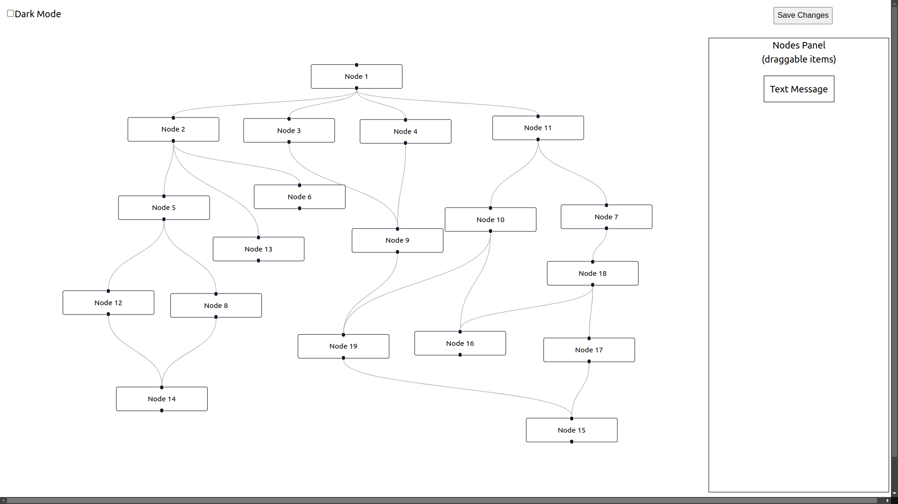
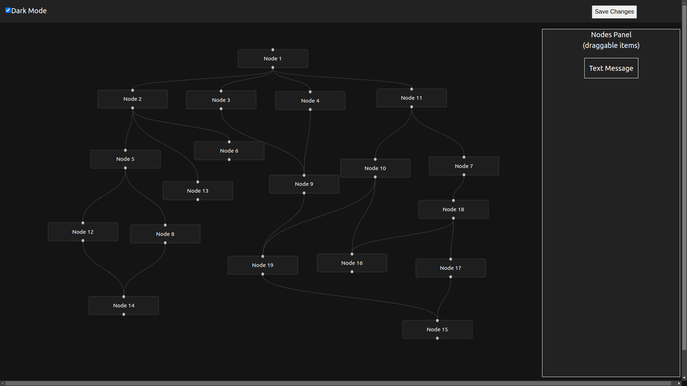

# 🧠 React Flow Node Editor

A drag-and-drop visual flow editor built using [@xyflow/react (React Flow)](https://reactflow.dev/), supporting:

- Node creation via drag-and-drop
- Real-time editing of node labels
- Light/Dark theme toggle
- Save validation to ensure all nodes are connected
- Modular and maintainable code structure

---

## 📸 Preview




---

## 🔗 Live URL

[https://reactflow-task.netlify.app/](https://reactflow-task.netlify.app/)

---

## 🎥 Demo Video URL

[Video demo](https://www.loom.com/share/ea96473ee5184577bf878159ebd2e1e4?sid=79ba4b40-ff79-4352-babc-9efaf604718b)

---

## 🚀 Features

- 🧱 **Drag & Drop Nodes** from a panel to the canvas
- ✏️ **Edit node content** in real time
- 🎨 **Light/Dark Theme Toggle**

---

## 🧑‍💻 Technologies Used

- React (with Hooks)
- [@xyflow/react](https://reactflow.dev/) (formerly React Flow)
- CSS (custom styling)
- Functional component-based structure

---

## 🔧 Getting Started

### 1. Clone the repository

```bash
git clone https://github.com/shlokmotwani/react-flow-task.git
cd react-flow-task
```

### 2. Install dependencies

```bash
npm install
```

### 3. Start the development server

```bash
npm run dev
```

App will be available at http://localhost:5173/ (or whatever your dev server shows).

## 🧪 How It Works

1. Drag Node ➝ Drop onto the canvas
2. Select Node ➝ Settings panel opens on the right
3. Edit Text ➝ Live preview of changes
4. Click Save ➝ Validates that all nodes are connected

- Theme Toggle ➝ Switch between light and dark mode

## ✅ Save Button Validation

When "Save Changes" is clicked:

- Ensures every node is connected to at least one other node
- If not, shows an alert with IDs of unconnected nodes
- If all nodes are valid, confirms with a success alert

## 🌘 Theme Toggle

- Use the checkbox in the top bar to switch between light and dark modes.
- Styles are applied dynamically to nodes and panels.

## 📥 Future Enhancements

1. Export / import flow as JSON
2. Custom node types (images, inputs, actions)
3. Zoom and pan controls
4. Auto-layout support

## 📄 License

MIT License © [Shlok Motwani]

## 🙌 Acknowledgements

- React Flow (XYFlow)
- React.js
